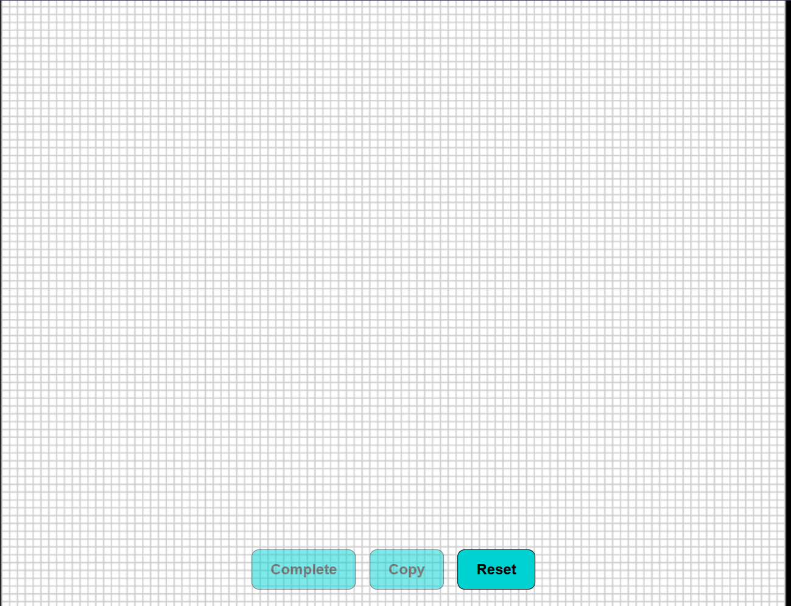
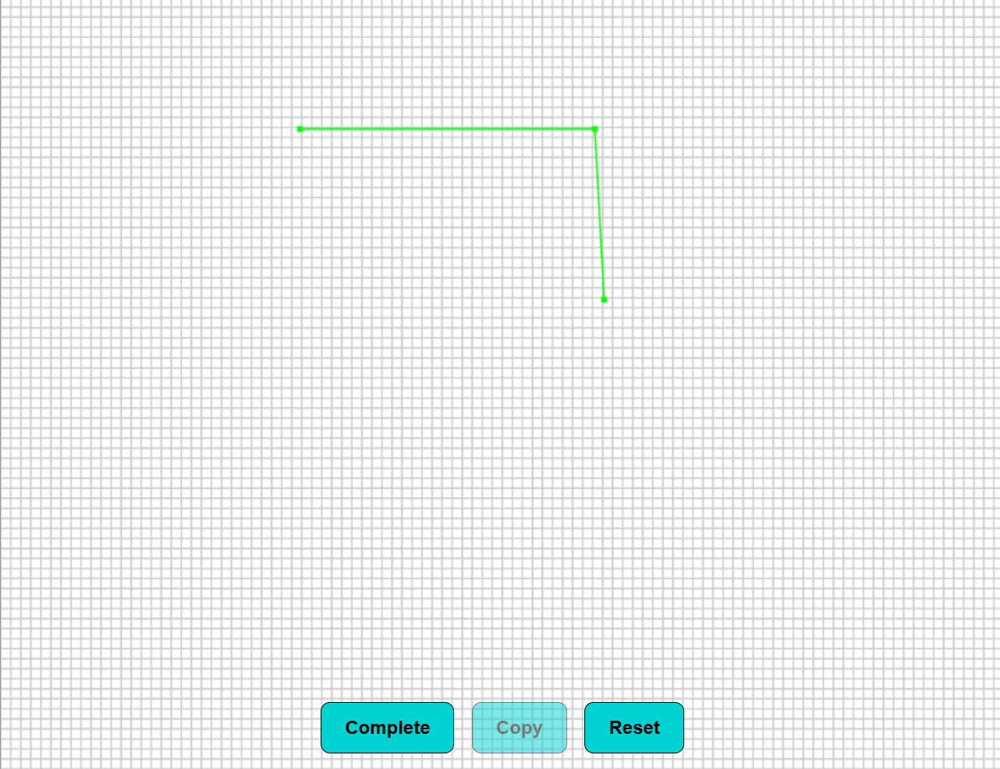
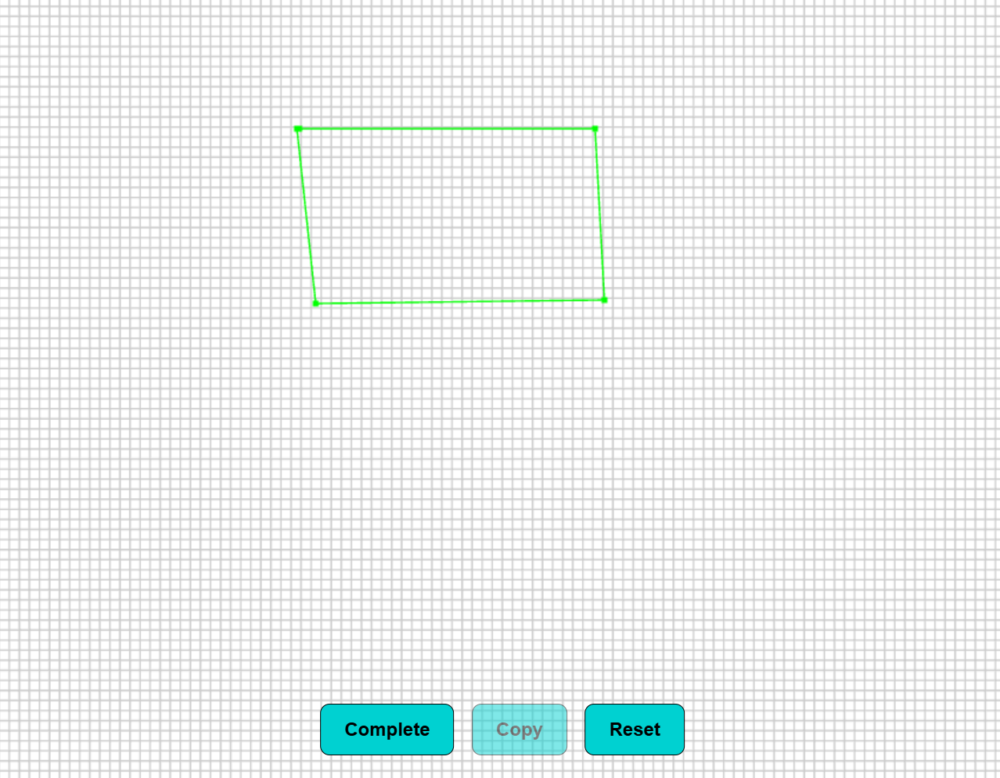
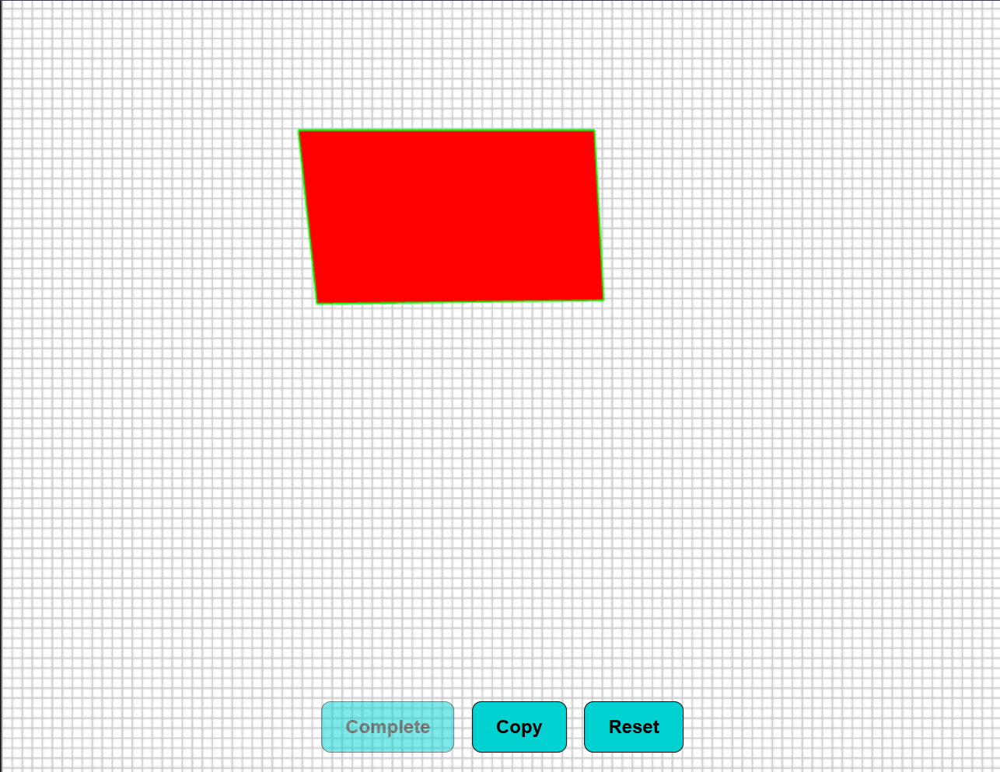
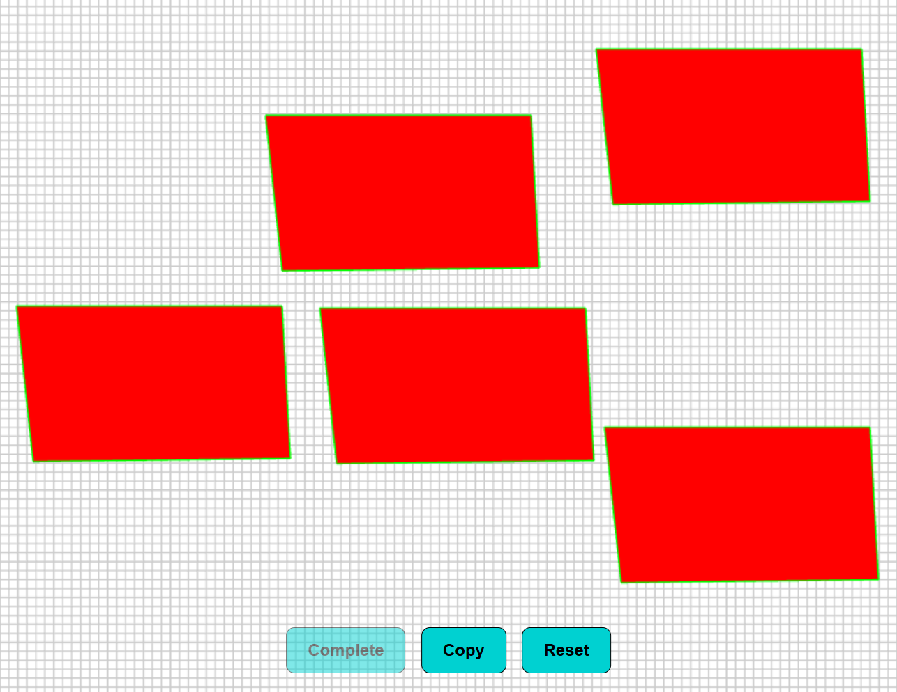
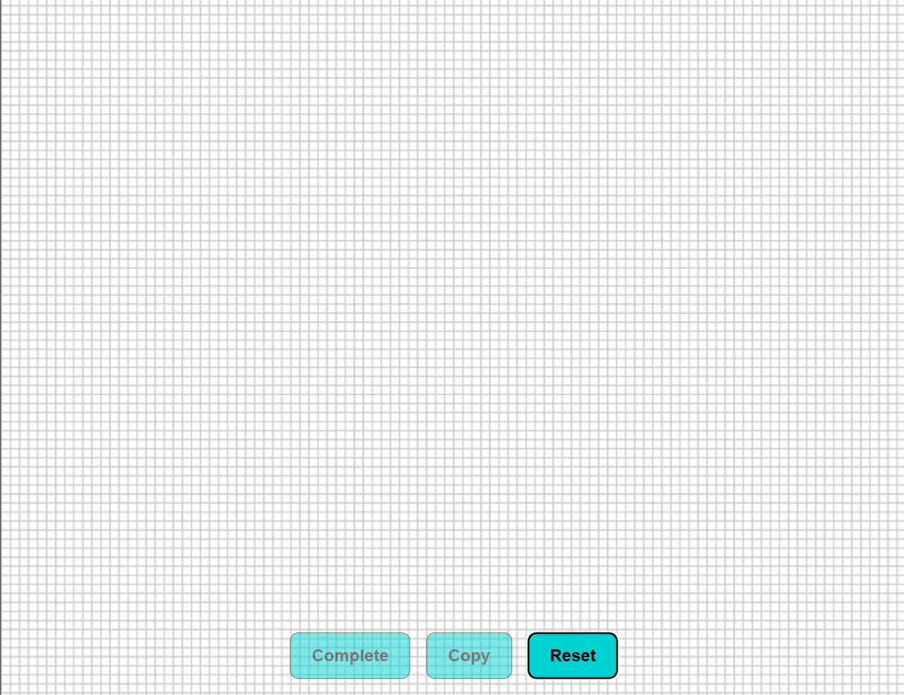

# Polygon Creator

## Description

Polygon Creator is a web-based tool built using Three.js that allows users to create, copy, and manipulate polygons interactively on a 2D grid. It provides an intuitive interface for users to define custom shapes and experiment with basic polygon operations.

## Features

- **Interactive Grid**: A white ground with a grid for easy placement of polygons.
- **Polygon Creation**: Click on the grid to place vertices and create a polygon.
- **Auto-Complete**: Automatically closes the polygon when the last vertex is near the first.
- **Copy & Move**: Duplicate existing polygons and reposition them within the scene.
- **Reset Scene**: Clear all polygons and start fresh.
- **Smooth Controls**: Pan and zoom support with Orthographic Camera for easy navigation.

### Polygon Home Page


### Creating a Polygon


### Polygon Marked With all vertices


### Complete Polygon


### Copying a Polygon


### Reset Scene


## Setup

### Installation

1. **Clone the repository:**
    ```bash
    git clone https://github.com/AsifMohd01/Polygon-Project
    cd Polygon-Project
    ```
2. **Run the project:**
    - Open the `index.html` file in a browser.
    - Or use the Live Server extension in VS Code to launch the project.

## Usage

### Polygon Creation
- Click on the grid to start creating a polygon.
- Once three or more vertices are placed, the polygon will complete automatically.

### Copy & Move Polygons
- Use the **Copy** button to duplicate the last created polygon and move it within the scene.

### Reset Scene
- Click **Reset** to clear all polygons and restart.

## Contributing

If you'd like to contribute, please fork the repository and submit a pull request.

## Contact

For any inquiries or issues, please contact [asif.mohd@campusuvce.in](mailto:asif.mohd@campusuvce.in).

